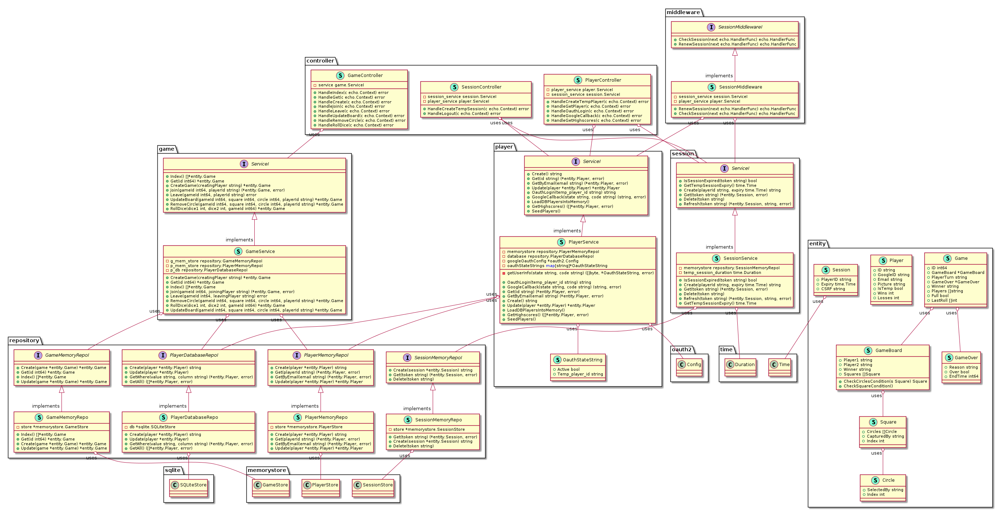

# Super Tic Tac Toe (WIP)

A variation of tic-tac-toe (three in a row) played with dice. The game board consists of 9 squares, each square has 9 circles. A player must capture 3 circles horizontally, diagonally or vertically (or capture 5 circles) to capture a square. To win, the player must capture three squares horizontally, diagonally or vertically. The total roll of two die decides what circle the player can select.

| Die roll | Description |
| ----------- | ----------- |
| 12 | Any uncaptured circle |
| 2 | Remove an opponents circle | 
| 7 | The centre of any circle |
| * | The corresponding circle |

## Features
- No authentication required for gameplay
- Authentication with Google to track wins, losses and keep an account
- Theme picker

### Server architecture 

as of 24/05/23